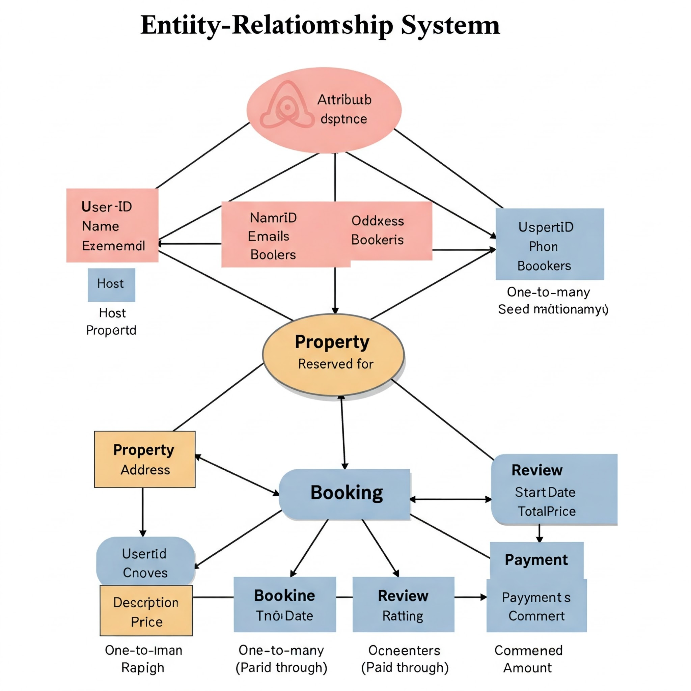

# Entity-Relationship Diagram Design Requirements

## Objectives

Creating a comprehensive Entity-Relationship (ER) diagram that represents the database structure for an Airbnb-like system.

## Specifications

### Core Entities and Their Attributes

#### 1. User Entity

- Primary Key: UserID
- Attributes
- FirstName
- LastName
- Email
- UserType
- Password - hashed
- PhoneNumber
- DateJoined
- ProfilePicture

#### 2. Property Entity

- Primary Key: PropertyID
- Foreign Key: HostID
- Attributes:
- Title
- Description
- Address
- City
- State/Province
- Country
- PostalCode
- PricePerNight
- NumberOfBedrooms
- NumberOfBathrooms
- PropertyType (Apartment, Home/House)
- MaxGuests
- Status (Available, Maintenance, Booked)

#### 3. Booking Entity

- Primary Key: BookingID
- Foreign Keys:
  - PropertyID (references Property)
  - GuestID (references User)
- Attributes:
  - CheckInDate
  - CheckOutDate
  - TotalPrice
  - NumberOfGuests
  - BookingStatus (Pending, Confirmed, Cancelled)
  - BookingDate
  
#### 4. Review Entity

- Primary Key: ReviewID
- Foreign Keys:
  - BookingID (references Booking)
  - GuestID (references User)
  - PropertyID (references Property)
- Attributes:
  - Rating
  - Comment
  - ReviewDate
  
#### 5. Payment Entity

- Primary Key: PaymentID
- Foreign Key: BookingID (references Booking)
- Attributes:
  - Amount
  - PaymentDate
  - PaymentStatus
  - PaymentMethod

### Entity Relationships

#### 1. User-Property Relationship

- Type: One-to-Many
- Description: A User (Host) can own multiple Properties
- Relationship Name: "Hosts"

#### 2. User-Booking Relationship

- Type: One-to-Many
- Description: A User (Guest) can make multiple Bookings
- Relationship Name: "Books"

#### 3. Property-Booking Relationship

- Type: One-to-Many
- Description: A Property can have multiple Bookings
- Relationship Name: "Reserved For"

#### 4. Booking-Review Relationship

- Type: One-to-One
- Description: A Booking can have one Review
- Relationship Name: "Generates"

#### 5. Booking-Payment Relationship

- Type: One-to-One
- Description: A Booking has one Payment
- Relationship Name: "Paid Through"

   
